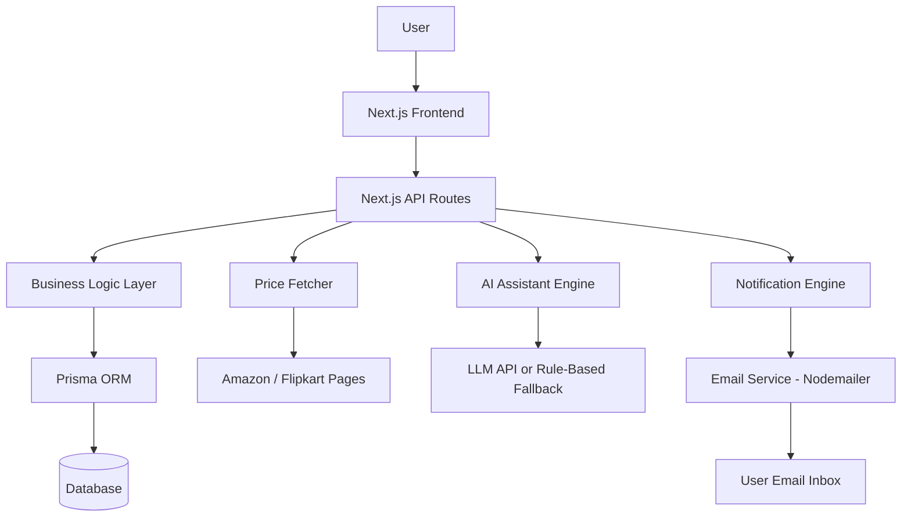
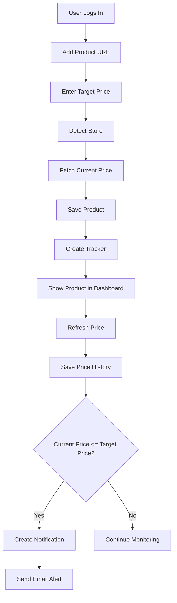

# 🛒 Pricelytix — AI-Powered Price Tracking Agent

<p align="center">
  <b>Track product prices, analyze price trends, receive smart alerts, and get AI-powered buy/wait recommendations.</b>
</p>

<p align="center">
  
  
  
  
  
  
</p>

---

## 📌 Project Overview

**Pricelytix** is an **AI-powered full-stack SaaS price tracking platform** that helps users monitor e-commerce product prices, store price history, receive notifications when prices reach their target, and get intelligent AI-based shopping recommendations.

Users can create an account, add product URLs, set target prices, refresh prices, view price history charts, receive in-app notifications, and get email alerts when the product price becomes less than or equal to the target price.

The project also includes an **AI Shopping Assistant** that can understand natural language shopping queries, extract product URLs and target prices, detect user intent, and provide buy/wait recommendations.

---

## 🎯 Problem Statement

Online product prices change frequently across platforms like Amazon and Flipkart. A product may be expensive today and become cheaper during a sale or discount period. Users usually need to manually visit product pages again and again to check whether the price has dropped.

This creates several problems:

- Users may miss important price drops.
- Users waste time checking the same product repeatedly.
- Users do not have a simple way to track price history.
- Users may not know whether to buy now or wait.
- Users need personalized alerts when a product reaches their expected price.

**Pricelytix solves this problem by automating product price tracking, storing price history, creating alerts, sending email notifications, and providing AI-powered shopping insights.**

---

## ✨ Key Features

### 🔐 Authentication

- User signup
- User login
- Secure logout
- Password hashing using bcryptjs
- JWT-based session handling
- HTTP-only cookie authentication
- Protected dashboard and private routes

### 👤 User Data Isolation

Each user has their own tracked products.

- User A cannot view User B's products.
- User A cannot edit User B's target price.
- User A cannot delete User B's tracker.
- User A cannot dismiss User B's notifications.

This makes Pricelytix a true multi-user SaaS application.

### 📦 Product Tracking

- Add product URL
- Set target price
- Detect store automatically
- Track product current price
- Preserve old price if scraping fails
- User-specific tracker creation
- Safe handling for unsupported or blocked stores

### 📊 Price History

- Stores historical price records
- Shows price trend chart
- Displays lowest recorded price
- Displays highest recorded price
- Shows last checked time
- Helps users understand price movement

### 🔔 In-App Notifications

A notification is created when:

```txt
currentPrice <= targetPrice
```

Features:

- Unread notification count
- Product-level alert banners
- Dismiss / mark notification as read
- Duplicate notification prevention
- Alert message when target price is reached

### 📧 Email Alerts

- Sends email when target price is reached
- Uses Nodemailer with SMTP
- Sends alert to tracker owner's email
- Uses fallback email if needed
- Handles SMTP failures safely
- Prevents duplicate email alerts
- Does not break price refresh if email fails

### 🤖 AI Shopping Assistant

The AI Assistant can understand natural language requests such as:

```
Track this laptop if it drops below 55000:
https://www.flipkart.com/example-product
```

It extracts:

- Intent
- Product URL
- Target price
- Summary
- Recommendation
- Next action

Example AI output:

```json
{
  "intent": "TRACK_PRODUCT",
  "productUrl": "https://www.flipkart.com/example-product",
  "targetPrice": 55000,
  "summary": "The user wants to track this product until it drops below ₹55,000.",
  "recommendation": "Track this product and wait for a price drop.",
  "nextAction": "Add this product to your tracker."
}
```

### 🧠 AI Price Insights

Pricelytix provides AI-style recommendations such as:

- BUY NOW
- WAIT
- WATCH CLOSELY
- WAIT AND REFRESH LATER

These insights are shown on:

- Dashboard (portfolio-level insight)
- Product details page (product-level insight)
- AI Assistant page

The app supports a real OpenAI-compatible API mode and also includes a fallback rule-based AI mode for demo reliability.

### ⏱ Scheduled Refresh

- Refresh one product manually
- Refresh all products manually
- Local scheduled refresh script
- Vercel Cron support
- Secure cron endpoint using `CRON_SECRET`
- Preserves last known price when scraping fails

### 🌑 Enterprise Dark SaaS UI

- Premium black and charcoal dashboard
- Sidebar navigation
- Responsive, compact product list cards
- Dark input fields and form controls
- Professional login/signup pages
- Modern SaaS-style dashboard layout
- Clean typography using the Inter font

---

## 🧩 Technology Stack

| Layer | Technology |
|---|---|
| Frontend | Next.js, React, TypeScript |
| Styling | Tailwind CSS |
| Backend | Next.js API Routes |
| ORM | Prisma |
| Local Database | SQLite |
| Production Database | PostgreSQL |
| Production DB Provider | Neon |
| Authentication | bcryptjs, JWT, HTTP-only cookies |
| Email | Nodemailer, Gmail SMTP |
| AI Layer | OpenAI-compatible API + fallback AI |
| Web Scraping | Cheerio, Playwright |
| Charts | Recharts |
| Deployment | Vercel |
| Version Control | GitHub |

---

## 🏗 System Architecture



---

## 🔁 Product Tracking Workflow



---

## 🛒 Price Fetching Strategy

**Amazon** — Price extraction uses Cheerio, which parses static HTML and extracts price from known selectors.

**Flipkart** — Uses Playwright because Flipkart pages are more dynamic. Flipkart also has strong anti-bot protection, so Pricelytix follows a safety-first approach:

- If a reliable price is found → save it
- If the price is blocked or unreliable → return null
- If null is returned → keep the last known price

This prevents wrong prices from triggering false alerts.

---

## 🗄 Database Models

Pricelytix uses five main database models.

**User** — Stores user account details.
- id, email, name, passwordHash, createdAt

**Product** — Stores product information.
- id, title, url, store, currentPrice, imageUrl, createdAt

**Tracker** — Connects a user to a product with a target price.
- id, userId, productId, targetPrice, isActive, createdAt

**PriceHistory** — Stores historical price values.
- id, productId, price, createdAt

**Notification** — Stores target price alerts.
- id, trackerId, productId, message, type, isRead, createdAt

---

## 📡 Important API Routes

| Method | Route | Purpose |
|---|---|---|
| POST | `/api/auth/signup` | Create user account |
| POST | `/api/auth/login` | Login user |
| POST | `/api/auth/logout` | Logout user |
| GET | `/api/auth/me` | Get current user |
| POST | `/api/products` | Add product tracker |
| PATCH | `/api/products/[id]/refresh` | Refresh one product |
| DELETE | `/api/products/[id]` | Delete product |
| PATCH | `/api/trackers/[id]` | Edit target price |
| POST | `/api/refresh-all` | Refresh all products |
| PATCH | `/api/notifications/[id]/read` | Mark notification as read |
| POST | `/api/ai/assistant` | AI assistant response |

---

## 🧠 Prompt Engineering

The AI assistant uses structured prompt engineering to produce predictable output. Instead of allowing the AI to return free-form text, the system asks it to return a strict JSON structure.

Prompt style:

```
You are an AI shopping assistant for Pricelytix.
Analyze the user's shopping request.
Extract the intent, product URL, target price, summary, recommendation, and next action.
Return only valid JSON.
```

Expected response format:

```json
{
  "intent": "TRACK_PRODUCT",
  "productUrl": "https://www.amazon.in/example",
  "targetPrice": 50000,
  "summary": "The user wants to track this product until it drops below ₹50,000.",
  "recommendation": "Track this product and wait for the price drop.",
  "nextAction": "Add this product to the tracker."
}
```

This improves accuracy, consistency, predictability, frontend rendering, and overall user experience.

---

## 🧠 AI Fallback Mode

If no AI API key is configured, the system still works using fallback AI.

Fallback AI uses:

- URL regex detection
- Target price number extraction
- Intent keyword matching
- Rule-based recommendation generation

Supported intents:

- `TRACK_PRODUCT`
- `PRICE_ADVICE`
- `GENERAL_HELP`

This ensures the AI assistant works even without paid API access.

---

## 🛡 Security Features

- Passwords are hashed using bcryptjs
- JWT is stored in an HTTP-only cookie
- Protected routes using middleware
- User data isolation using `userId`
- API routes verify ownership before updates
- Secrets stored in `.env` and Vercel environment variables
- SMTP password and JWT secret are never exposed to the client
- AI API key is used only on the server side

---

## 📦 Local Setup

### 1. Clone the Repository

```bash
git clone https://github.com/Nithish-code17/pricelytix.git
cd pricelytix
```

### 2. Install Dependencies

```bash
npm install
```

### 3. Configure Environment Variables

Create a `.env` file in the project root:

```env
DATABASE_URL="file:./dev.db"

JWT_SECRET="your-local-secret-key"

SMTP_HOST="smtp.gmail.com"
SMTP_PORT="587"
SMTP_USER="your-email@gmail.com"
SMTP_PASS="your-gmail-app-password"
ALERT_EMAIL="your-alert-email@gmail.com"

AI_API_KEY=""
AI_BASE_URL="https://api.openai.com/v1"
AI_MODEL=""

CRON_SECRET="your-cron-secret"
NEXT_PUBLIC_APP_URL="http://localhost:3000"
```

### 4. Generate Prisma Client

```bash
npx prisma generate
```

### 5. Run Migrations

```bash
npx prisma migrate dev
```

### 6. Start Development Server

```bash
npm run dev
```

Open [http://localhost:3000](http://localhost:3000)

---

## 🧪 Useful Scripts

| Command | Purpose |
|---|---|
| `npm run dev` | Start development server |
| `npm run build` | Build project |
| `npm run start` | Start production server |
| `npx prisma generate` | Generate Prisma client |
| `npx prisma migrate dev` | Run local migrations |
| `npm run refresh:all` | Refresh all product prices |
| `npm run test:email` | Test email alert system |
| `npm run test:flipkart` | Test Flipkart price fetching |

---

## 🚀 Production Deployment

The project is deployed using GitHub, Vercel, and Neon PostgreSQL.

### Production Environment Variables

Add these variables in Vercel:

```env
DATABASE_URL=""
JWT_SECRET=""
SMTP_HOST=""
SMTP_PORT="587"
SMTP_USER=""
SMTP_PASS=""
ALERT_EMAIL=""
CRON_SECRET=""
AI_API_KEY=""
AI_BASE_URL="https://api.openai.com/v1"
AI_MODEL=""
NEXT_PUBLIC_APP_URL=""
```

### Production Database

Local development uses SQLite, but production uses PostgreSQL. Production database provider: **Neon PostgreSQL**.

### Deployment Steps

1. Push code to GitHub.
2. Create a Neon PostgreSQL database.
3. Copy the Neon PostgreSQL connection string.
4. Import the GitHub repo into Vercel.
5. Add environment variables in Vercel.
6. Deploy the project.
7. Create database tables using Prisma.
8. Test signup, login, dashboard, and product tracking.

---

## ✅ Testing Checklist

Before final demo, verify:

- [ ] Signup works
- [ ] Login works
- [ ] Logout works
- [ ] Dashboard loads
- [ ] Add product works
- [ ] Product refresh works
- [ ] Refresh all works
- [ ] Edit target price works
- [ ] Delete product works
- [ ] Notification appears
- [ ] Dismiss notification works
- [ ] Email test works
- [ ] AI assistant works
- [ ] AI fallback mode works
- [ ] Product details page loads
- [ ] Price history chart renders
- [ ] Protected routes redirect when logged out

---
