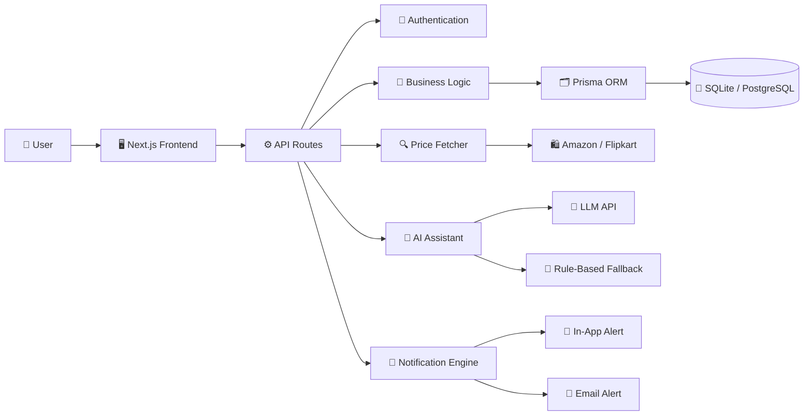
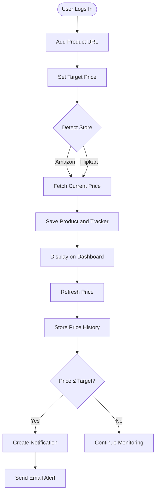
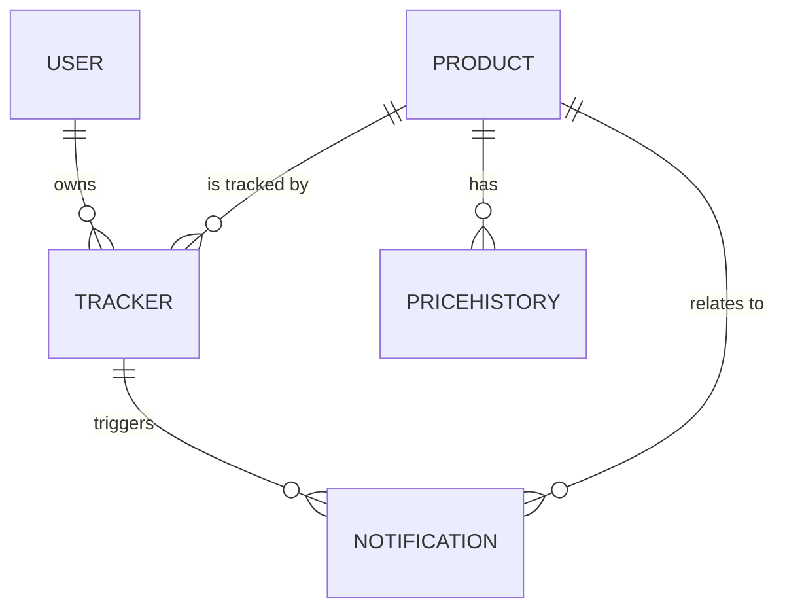

<div align="center">

# 🛒 Pricelytix

### AI-Powered Price Tracking and Smart Shopping Assistant

**Track prices, understand trends, receive smart alerts, and know when to buy.**

<p>
  
  
  
  
</p>

<p>
  
  
  
</p>

<p>
  
  
</p>

[Overview](#-overview) • [Features](#-key-features) • [Architecture](#-architecture) • [Setup](#-quick-start) • [Roadmap](#-roadmap)

</div>

---

## 📌 Overview

**Pricelytix** is a full-stack SaaS application that automates e-commerce price tracking and helps users decide whether to **buy now, wait, or continue monitoring** a product.

Users can add Amazon or Flipkart product URLs, set target prices, view price history, receive in-app and email alerts, and interact with an AI shopping assistant using natural-language requests.

> **Alert condition**
>
> ```text
> currentPrice <= targetPrice
> ```

### Why Pricelytix?

* Eliminates repeated manual price checking
* Helps users avoid missing price drops
* Stores historical prices for trend analysis
* Sends personalized target-price alerts
* Provides AI-based buying recommendations
* Supports secure, isolated accounts for multiple users

---

## ✨ Key Features

| Feature                  | What it does                                                                                 |
| ------------------------ | -------------------------------------------------------------------------------------------- |
| 🔐 Secure Authentication | Signup, login, logout, bcrypt password hashing, JWT sessions, and HTTP-only cookies          |
| 👤 User Data Isolation   | Prevents users from accessing or modifying another user's trackers and notifications         |
| 📦 Product Tracking      | Tracks Amazon and Flipkart products with user-defined target prices                          |
| 📊 Price History         | Stores price records and displays trends, highest price, lowest price, and last checked time |
| 🔔 In-App Alerts         | Creates notifications when a product reaches its target price                                |
| 📧 Email Alerts          | Sends target-price emails through Nodemailer and SMTP                                        |
| 🤖 AI Assistant          | Extracts intent, product URLs, and target prices from natural-language messages              |
| 🧠 Shopping Insights     | Generates `BUY NOW`, `WAIT`, and `WATCH CLOSELY` recommendations                             |
| ⏱ Scheduled Refresh      | Supports manual refresh, local scheduling, and protected Vercel Cron jobs                    |
| 🌑 SaaS Interface        | Responsive dark dashboard with compact cards, sidebar navigation, and charts                 |

---

## 🤖 AI Shopping Assistant

The assistant understands requests such as:

```text
Track this laptop if it drops below 55000:
https://www.flipkart.com/example-product
```

It returns structured data that can be safely used by the frontend:

```json
{
  "intent": "TRACK_PRODUCT",
  "productUrl": "https://www.flipkart.com/example-product",
  "targetPrice": 55000,
  "summary": "The user wants to track this product until it drops below ₹55,000.",
  "recommendation": "Track this product and wait for a price drop.",
  "nextAction": "Add this product to your tracker."
}
```

### Supported AI Modes

* **API mode:** Uses an OpenAI-compatible API.
* **Fallback mode:** Uses URL detection, price extraction, keyword matching, and rule-based recommendations.

Supported intents:

* `TRACK_PRODUCT`
* `PRICE_ADVICE`
* `GENERAL_HELP`

---

## 🧩 Technology Stack

| Layer               | Technology                                  |
| ------------------- | ------------------------------------------- |
| Frontend            | Next.js, React, TypeScript                  |
| Styling             | Tailwind CSS                                |
| Backend             | Next.js API Routes                          |
| ORM                 | Prisma                                      |
| Local Database      | SQLite                                      |
| Production Database | Neon PostgreSQL                             |
| Authentication      | bcryptjs, JWT, HTTP-only cookies            |
| Web Scraping        | Cheerio, Playwright                         |
| AI                  | OpenAI-compatible API + rule-based fallback |
| Email               | Nodemailer, Gmail SMTP                      |
| Charts              | Recharts                                    |
| Deployment          | Vercel                                      |

---

## 🏗 Architecture


```mermaid
flowchart LR
    U["👤 User"] --> FE["🖥️ Next.js Frontend"]
    FE --> API["⚙️ API Routes"]

    API --> AUTH["🔐 Authentication"]
    API --> LOGIC["🧩 Business Logic"]
    LOGIC --> ORM["🗂️ Prisma ORM"]
    ORM --> DB[("💾 SQLite / PostgreSQL")]

    API --> FETCHER["🔍 Price Fetcher"]
    FETCHER --> STORES["🛍️ Amazon / Flipkart"]

    API --> AI["🤖 AI Assistant"]
    AI --> LLM["🧠 LLM API"]
    AI --> FALLBACK["📏 Rule-Based Fallback"]

    API --> ALERTS["🔔 Notification Engine"]
    ALERTS --> APP["📱 In-App Alert"]
    ALERTS --> EMAIL["📧 Email Alert"]
```

### Product Tracking Flow


```mermaid
flowchart TD
    A(["User Logs In"]) --> B["Add Product URL"]
    B --> C["Set Target Price"]
    C --> D{"Detect Store"}
    D -->|Amazon| E["Fetch Current Price"]
    D -->|Flipkart| E
    E --> F["Save Product and Tracker"]
    F --> G["Display on Dashboard"]
    G --> H["Refresh Price"]
    H --> I["Store Price History"]
    I --> J{"Price ≤ Target?"}
    J -->|Yes| K["Create Notification"]
    K --> L["Send Email Alert"]
    J -->|No| M["Continue Monitoring"]
```

---

## 🛒 Price Fetching Strategy

### Amazon

Amazon prices are extracted with **Cheerio** by parsing static HTML and checking known price selectors.

### Flipkart

Flipkart pages are more dynamic, so Pricelytix uses **Playwright**. Because anti-bot protection can block or distort results, the application follows a safety-first approach:

1. Save the price only when it is reliable.
2. Return `null` when the result is blocked or uncertain.
3. Preserve the last known valid price when scraping fails.
4. Avoid generating alerts from unreliable values.

---

## 🗄 Database Models

| Model          | Purpose                                    | Main Fields                                                              |
| -------------- | ------------------------------------------ | ------------------------------------------------------------------------ |
| `User`         | Stores account information                 | `id`, `email`, `name`, `passwordHash`, `createdAt`                       |
| `Product`      | Stores product details                     | `id`, `title`, `url`, `store`, `currentPrice`, `imageUrl`, `createdAt`   |
| `Tracker`      | Connects a user, product, and target price | `id`, `userId`, `productId`, `targetPrice`, `isActive`, `createdAt`      |
| `PriceHistory` | Stores historical prices                   | `id`, `productId`, `price`, `createdAt`                                  |
| `Notification` | Stores price alerts                        | `id`, `trackerId`, `productId`, `message`, `type`, `isRead`, `createdAt` |


```mermaid
erDiagram
    USER ||--o{ TRACKER : owns
    PRODUCT ||--o{ TRACKER : "is tracked by"
    PRODUCT ||--o{ PRICEHISTORY : has
    TRACKER ||--o{ NOTIFICATION : triggers
    PRODUCT ||--o{ NOTIFICATION : "relates to"
```

---

## 📡 API Routes

| Method   | Route                          | Purpose                         |
| -------- | ------------------------------ | ------------------------------- |
| `POST`   | `/api/auth/signup`             | Create a user account           |
| `POST`   | `/api/auth/login`              | Authenticate a user             |
| `POST`   | `/api/auth/logout`             | End the current session         |
| `GET`    | `/api/auth/me`                 | Return the authenticated user   |
| `POST`   | `/api/products`                | Add a product tracker           |
| `PATCH`  | `/api/products/[id]/refresh`   | Refresh one product price       |
| `DELETE` | `/api/products/[id]`           | Delete a tracked product        |
| `PATCH`  | `/api/trackers/[id]`           | Update a target price           |
| `POST`   | `/api/refresh-all`             | Refresh every tracked product   |
| `PATCH`  | `/api/notifications/[id]/read` | Mark a notification as read     |
| `POST`   | `/api/ai/assistant`            | Process an AI assistant request |

---

## 🛡 Security

* Password hashing with `bcryptjs`
* JWT sessions stored in HTTP-only cookies
* Middleware-protected private routes
* Ownership validation using `userId`
* Server-side AI and SMTP credentials
* Secrets stored in environment variables
* Protected cron endpoint using `CRON_SECRET`
* Safe email failure handling

---

## 🚀 Quick Start

### 1. Clone the Repository

```bash
git clone https://github.com/Nithish-code17/pricelytix.git
cd pricelytix
```

### 2. Install Dependencies

```bash
npm install
```

### 3. Configure Environment Variables

Create a `.env` file in the project root:

```env
DATABASE_URL="file:./dev.db"
JWT_SECRET="your-local-secret-key"

SMTP_HOST="smtp.gmail.com"
SMTP_PORT="587"
SMTP_USER="your-email@gmail.com"
SMTP_PASS="your-gmail-app-password"
ALERT_EMAIL="your-alert-email@gmail.com"

AI_API_KEY=""
AI_BASE_URL="https://api.openai.com/v1"
AI_MODEL=""

CRON_SECRET="your-cron-secret"
NEXT_PUBLIC_APP_URL="http://localhost:3000"
```

> Never commit real credentials or production secrets to GitHub.

### 4. Prepare the Database

```bash
npx prisma generate
npx prisma migrate dev
```

### 5. Start the Development Server

```bash
npm run dev
```

Open `http://localhost:3000` in your browser.

---

## 🧪 Useful Commands

| Command                  | Purpose                       |
| ------------------------ | ----------------------------- |
| `npm run dev`            | Start the development server  |
| `npm run build`          | Create a production build     |
| `npm run start`          | Start the production server   |
| `npx prisma generate`    | Generate the Prisma client    |
| `npx prisma migrate dev` | Run local database migrations |
| `npm run refresh:all`    | Refresh all product prices    |
| `npm run test:email`     | Test the email alert system   |
| `npm run test:flipkart`  | Test Flipkart price fetching  |

---

## 🌐 Production Deployment

Pricelytix uses **GitHub**, **Vercel**, and **Neon PostgreSQL** in production.

1. Push the project to GitHub.
2. Create a Neon PostgreSQL database.
3. Add the Neon connection string to Vercel.
4. Configure the required environment variables.
5. Run the required Prisma database setup.
6. Deploy the application.
7. Test authentication, tracking, notifications, email, and AI features.

---

## ✅ Testing Checklist

* [ ] Signup, login, and logout work
* [ ] Protected routes reject unauthenticated users
* [ ] Products can be added, refreshed, updated, and deleted
* [ ] Price history and charts load correctly
* [ ] Target-price notifications appear
* [ ] Duplicate notifications are prevented
* [ ] Email alerts work without breaking refresh jobs
* [ ] AI assistant works with an API key
* [ ] AI fallback mode works without an API key

---

## ⚠️ Current Limitations

* Amazon and Flipkart may block scraping.
* Real AI mode requires a compatible API key.
* Email alerts require valid SMTP credentials.
* Vercel Hobby cron has scheduling limitations.
* A mobile app and WhatsApp alerts are not yet available.

---

## 🔮 Roadmap

* [ ] WhatsApp alerts
* [ ] Chrome extension
* [ ] Product comparison
* [ ] Mobile application
* [ ] Admin dashboard
* [ ] AI price prediction
* [ ] Auto-buy assistant
* [ ] Reliable scraping-provider integration
* [ ] Subscription and payment system

---

## 🤝 Contributing

Contributions, suggestions, and bug reports are welcome.

1. Fork the repository.
2. Create a feature branch.
3. Commit and push your changes.
4. Open a pull request.

---

## 📄 License

This project is distributed under the **MIT License**.

---

## 👨‍💻 Author

<div align="center">

### Nithish Sarwin

**Artificial Intelligence & Machine Learning Student | Java and Backend Developer**

[](https://github.com/Nithish-code17)

</div>

---

<div align="center">

**Built to make online shopping more informed, timely, and intelligent.**

⭐ Star the repository if you find Pricelytix useful.

</div>
